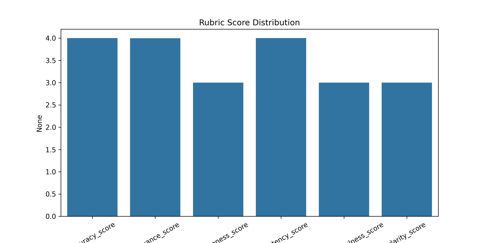
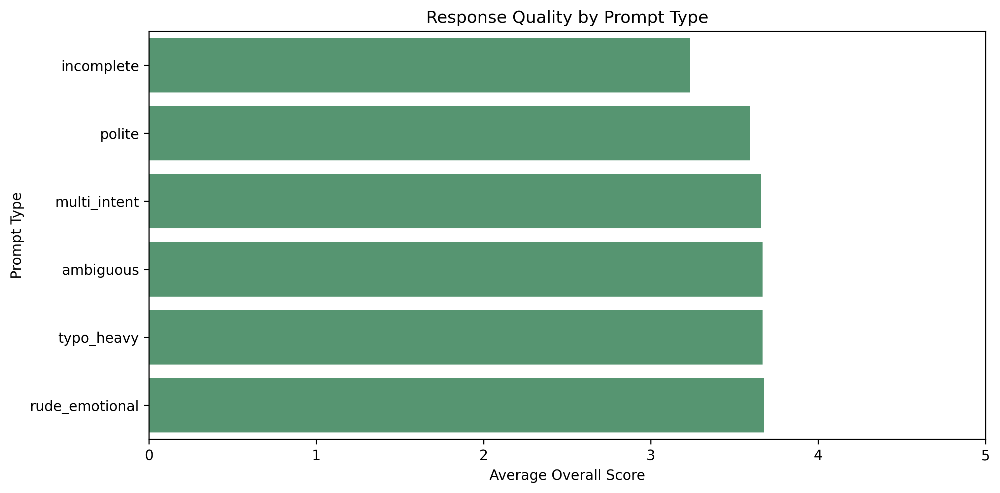
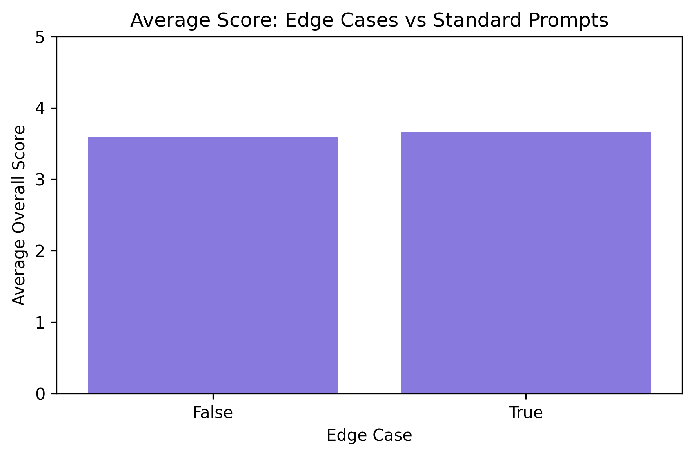
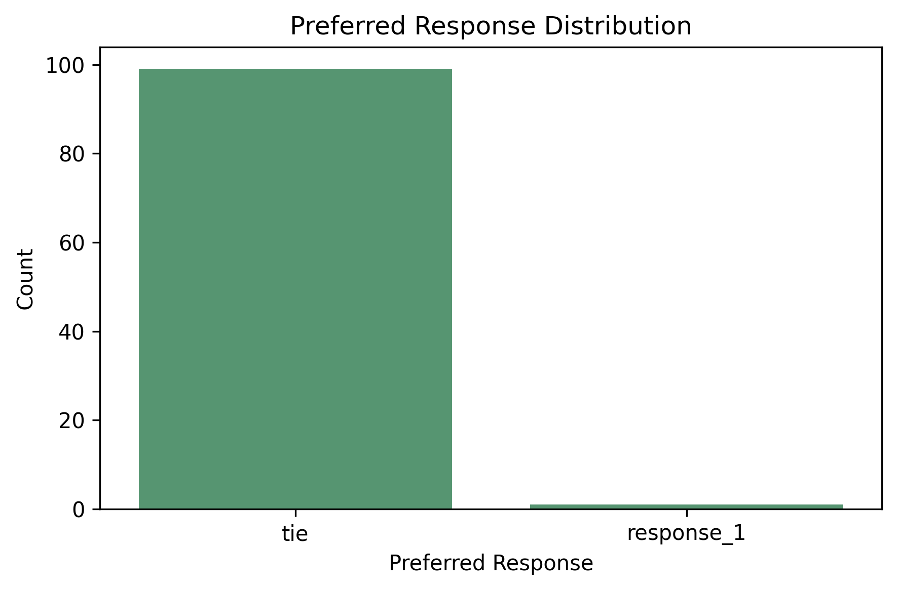
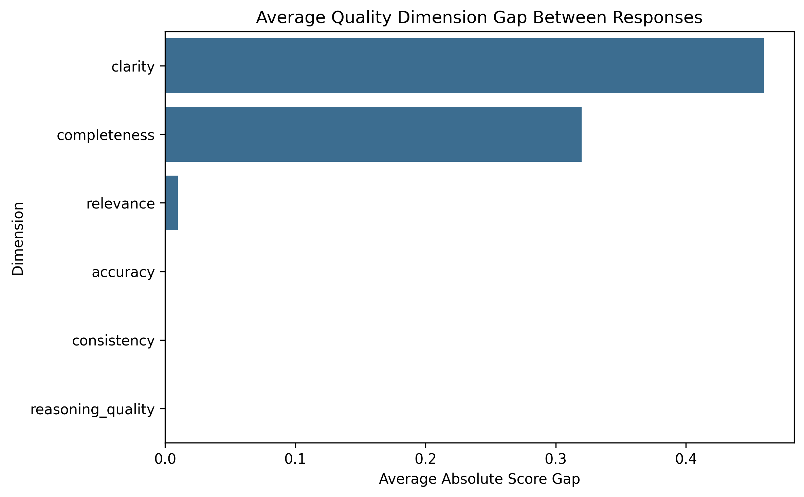
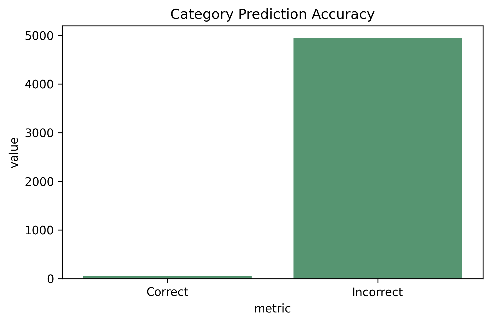
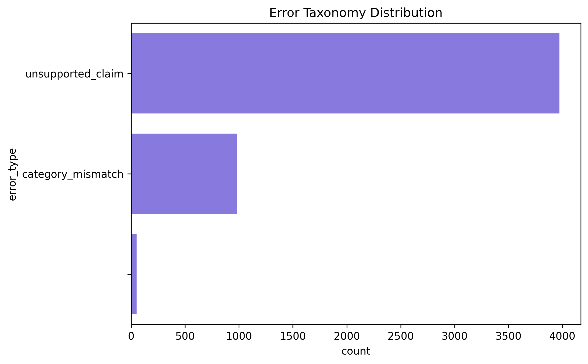

# # 🧠 Patrick Adu Osei — AI Evaluation & Data Analytics Portfolio

This portfolio showcases end-to-end AI evaluation and data analytics projects, including chatbot response quality scoring, prompt robustness analysis, pairwise response evaluation, and factual grounding validation using structured datasets. It also includes analytics projects in SEO performance, customer churn, e-commerce sales, and survey analysis.

## 📌 Overview
This portfolio showcases end-to-end **AI evaluation and data analytics projects**, focusing on:

- AI response quality evaluation  
- Factual grounding and taxonomy validation  
- Prompt robustness testing  
- Side-by-side response comparison  
- E-commerce, SEO, and business analytics  

---

## 🎯 Core Focus Areas

### ✅ AI Evaluation
- Rubric-based scoring  
- Error taxonomy analysis  
- Prompt robustness testing  
- Pairwise response evaluation  
- Factual grounding validation  

---

### ✅ Data Analytics
- SQL & Python analysis  
- Dashboard-driven insights  
- KPI reporting & business recommendations  
- SEO, churn, and e-commerce analytics  

---

## 👤 About Me

I am a **Data Analyst specialising in AI Evaluation and Data Quality**, combining structured analysis with business insight.

My work focuses on:
- evaluating AI-generated outputs  
- identifying quality gaps  
- improving decision-making through analytics  

---

- 🔗 [LinkedIn](https://www.linkedin.com/in/Patrick-Adu-Osei)  
- 🔗 [GitHub Profile](https://github.com/kwakusei1m-tech)  

---

# 🚀 AI EVALUATION PROJECTS

---

## ✅ AI Chatbot Response Quality Evaluation (Rubric-Based)

🔗 [View Project](https://github.com/kwakusei1m-tech/AI-Evaluation-of-E-commerce-Chatbot-Responses-Using-Rubric-Based-Quality-Scoring)




**Insight:**  
Chatbot responses are largely correct, but quality issues arise from **generic responses and weak guidance**, not incorrect answers.

---

## ✅ Chatbot Robustness to Real-World Language

🔗 [View on GitHub](https://github.com/kwakusei1m-tech)





**Insight:**  
The chatbot remains stable across noisy prompt types, but shows **low differentiation and generic behaviour**.

---

## ✅ Pairwise AI Response Evaluation

🔗 [View Project](https://github.com/kwakusei1m-tech/AI-Pairwise-Response-Evaluation-Using-Preference-Based-Scoring-and-Error-Analysis)






**Insight:**  
Responses are usually similar in quality, with **clarity and completeness driving preference decisions**.

---

## ✅ Product Category & Factual Grounding (ASIN)

🔗 [View Project](https://github.com/kwakusei1m-tech/AI-Evaluation-of-Product-Category-Assignment-and-Factual-Grounding-Using-Amazon-ASIN-Taxonomy)






**Insight:**  
AI struggles with factual grounding — **unsupported category assignments dominate errors**.

---

# 📊 DATA ANALYTICS PROJECTS

---

## ✅ Stack Overflow Survey Analysis

🔗 [View Project](https://github.com/kwakusei1m-tech/stack-overflow-survey-analysis)


**Insight:**  
Strong demand for **Python, SQL, and cloud technologies** across developer ecosystems.

---

## ✅ SEO Performance Analysis

🔗 [View Project](https://github.com/kwakusei1m-tech)


**Insight:**  
High-impression/low-CTR keywords present **clear optimisation opportunities for traffic growth**.

---

## ✅ Customer Churn Analysis

🔗 [View Project](https://github.com/kwakusei1m-tech)


**Insight:**  
Early-stage customers show **highest churn risk**, requiring onboarding improvements.

---

## ✅ E-commerce Sales Analysis

🔗 [View Project](https://github.com/kwakusei1m-tech)


**Insight:**  
Revenue is concentrated in **top-performing products and regions**, showing clear growth leverage points.

---

# 💡 KEY PORTFOLIO INSIGHT

> The main challenge across AI and analytics systems is not correctness alone, but **quality, clarity, and factual grounding**.

---

# 🧩 Skills Demonstrated

- AI Evaluation & LLM Quality Analysis  
- Data Quality & Validation  
- Error Taxonomy & Structured Reasoning  
- SQL, Python, Excel, Jupyter Notebook  
- SEO, E-commerce & Customer Analytics  

---

# 🛠 Tools & Technologies

- Python (Pandas, NumPy, Seaborn)  
- SQL  
- Excel  
- Jupyter Notebook  
- Data Visualization  
- GitHub  

---

# 📂 Repository Structure

```bash
/README.md
/visuals/
